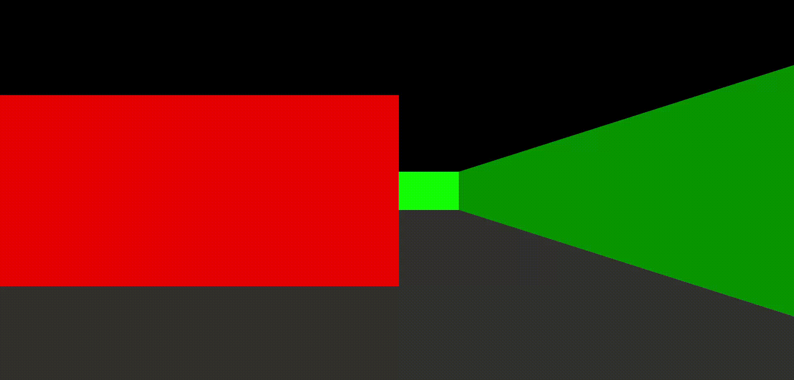

# Raycasting engine
Pseudo 3D engine developed in **Typescript** using the Digital Differential Analysis (DDA).

## Table of Contents
- [Requirements](#requirements)
- [Installation](#installation)
- [Usage](#usage)
- [Controls](#controls)

## Requirements
* **Node.js**
* **npm**

>[!IMPORTANT]
>The installation process downloads **Vite** and **Typescript** as development dependencies.

## Usage
To run the engine in development mode with hot-reload, or to compile for production:

* **Development**: `npm run dev`
* **Production**: `npm run build`

## Controls
|Action|Key|
|-|-|
|Move Forward|W|
|Move Backward|S|
|Turn Left|A|
|Turn Right|D|
